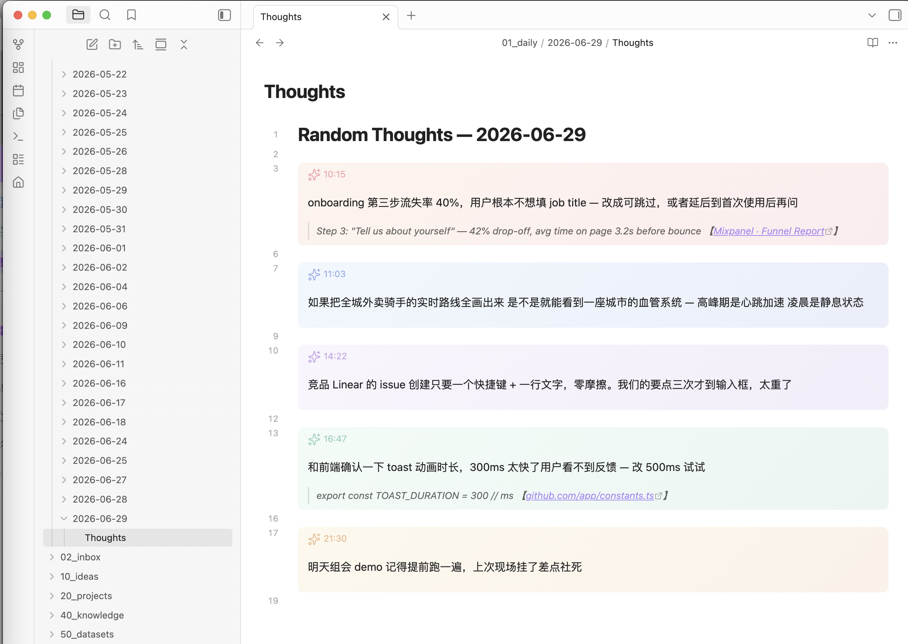

<div align="center">

# Eureka

**Press a hotkey. Type a thought. Done.**

一键从任意界面捕获屏幕与选中文本，写入 Obsidian。

[](https://github.com/Claire1217/Eureka/stargazers)
[](https://github.com/Claire1217/Eureka/releases)
[](LICENSE)

[Download](https://github.com/Claire1217/Eureka/releases) · [中文说明](#安装)

</div>

<p align="center">
  
</p>

## Features

- **Global hotkey** — capture thoughts from any app without switching windows
- **Screenshot capture** — annotate screenshots with your thoughts (⌥R)
- **Context-aware** — automatically captures selected text and browser URL
- **AI Quick Answer** — type `/` to ask AI a question inline (DeepSeek)
- **Obsidian or Apple Notes** — choose where to save

## Install

### Download (recommended)

```bash
curl -fsSL https://raw.githubusercontent.com/Claire1217/Eureka/main/install.sh | bash
```

Or manually: download `.zip` from [Releases](https://github.com/Claire1217/Eureka/releases), unzip to `/Applications`, then:

```bash
xattr -dr com.apple.quarantine /Applications/Eureka.app
```

### First launch

1. **System Settings → Privacy & Security → Accessibility** → enable Eureka
2. Right-click **E!** menu bar icon → **Settings** → choose your save folder
3. (Optional) Paste a [DeepSeek API key](https://platform.deepseek.com) for `/` AI answers

### Build from source

```bash
git clone https://github.com/Claire1217/Eureka.git
cd Eureka && ./deploy.sh
```

## Usage

| Action | Hotkey |
|--------|--------|
| Capture thought | ⌥T |
| Screenshot + comment | ⌥R |

- Press **Enter** to save, **Esc** to cancel
- Start with `/` to ask AI (answer streams inline)
- Select text before pressing hotkey to include as context
- Hotkeys configurable in Settings

## File Structure

```
your-folder/
  2026-06-29/
    Thoughts.md       # all thoughts for the day
    attachments/      # screenshots
```

## Obsidian Styling

Styled thought cards are **installed automatically** on first save. If Obsidian is already open, reopen it to load the snippet.

Manual: copy `thought-cards.css` → `.obsidian/snippets/`, enable in Obsidian Settings → Appearance → CSS snippets.

## CLI Configuration

```bash
defaults write com.eureka.app vaultPath "/path/to/vault/daily"
defaults write com.eureka.app storageBackend "obsidian"  # or "notes"
defaults write com.eureka.app llmApiKey "sk-your-key"    # optional
killall Eureka; open /Applications/Eureka.app
```

---

<details>
<summary><strong>安装</strong></summary>

### 下载安装（推荐）

```bash
curl -fsSL https://raw.githubusercontent.com/Claire1217/Eureka/main/install.sh | bash
```

或手动：从 [Releases](https://github.com/Claire1217/Eureka/releases) 下载 `.zip`，解压到 `/Applications`，然后：

```bash
xattr -dr com.apple.quarantine /Applications/Eureka.app
```

### 首次启动

1. **系统设置 → 隐私与安全性 → 辅助功能** → 开启 Eureka
2. 右键菜单栏 **E!** 图标 → **Settings** → 选择保存文件夹
3. （可选）粘贴 [DeepSeek API key](https://platform.deepseek.com)，开启 `/` AI 问答

</details>

<details>
<summary><strong>Agent Installation</strong></summary>

For AI coding agents (Claude Code, Cursor, etc.):

```bash
# 1. Install
curl -fsSL https://raw.githubusercontent.com/Claire1217/Eureka/main/install.sh | bash

# 2. Configure
defaults write com.eureka.app vaultPath "/absolute/path/to/folder"
defaults write com.eureka.app storageBackend "obsidian"
defaults write com.eureka.app llmApiKey "sk-xxx"  # optional

# 3. Restart
killall Eureka 2>/dev/null; open /Applications/Eureka.app
```

**Manual step required:** System Settings → Privacy & Security → Accessibility → enable Eureka

</details>

## License

MIT
